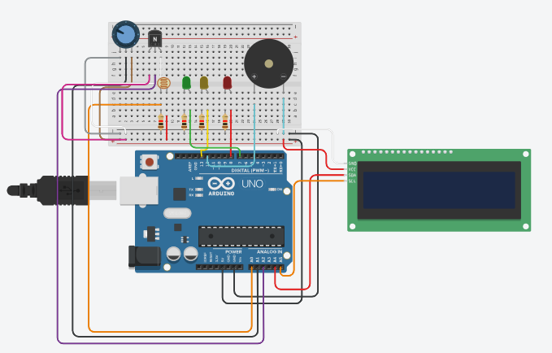

> <h1>Segundo Projeto da Vinheria Agnello</h1>

Neste projeto buscamos atender aos pedidos do cliente para não só monitorarmos a luz ambiente como também monitorarmos 
a temperatura e umidade do ambiente onde os vinhos serão conservados

Abaixo está o passo a passo de como realizamos o projeto

<a href="https://youtu.be/MCSw4fT85kU?si=KpTZby5886DSWUUW" target="_blank">
Este link direciona para um conteúdo explicativo sobre o projeto

> <h2>Como nosso sistema funciona</h2>

<h4><strong>Nosso sistema tem como principal objetivo monitorar os níveis de luminosidade, temperatura e umidade do ambiente</strong></h4>
<li><strong>Luminosidade:</strong>O sistema irá monitorar os níveis de luminosidade ambiente, e avisar caso algo esteja fora dos padrões desejados.</li>

<li><strong>Temperatutra:</strong>O sitema irá monitorar as flutuações térmicas do ambiente e notificar caso esteja fora dos padrões desejados.</li>

<li><strong>Umidade:</strong>Aqui o sistema irá monitorar a umidade ambiente e notificar caso a umidade esteja abaixo de 60% ou acima de 80%</li>

> <h2>Componentes utilizados e plataforma </h2>
<li>Plataforma utilizada Tinkercad</li>
<li>Arduíno UNO</li>
<li>Protoboard</li>
<li>DHT11</li>
<li>LDR</li>
<li>Buzzer</li>
<li>Resitores de 220Ω e 10kΩ</li>
<li>LED Verde</li>
<li>LED Amarelo</li>
<li>LED Vermelho</li>

> <h2>Abaixo está um "guia" de montagem para você se basear caso queira!</h2>

> <h2>Agora basta implementar o código que disponibilizaremos abaixo e tudo pronto!!</h2>

<a href="https://www.tinkercad.com/things/aK5Ktq5cWln-batata/editel?returnTo=https%3A%2F%2Fwww.tinkercad.com%2Fdashboard%2Fdesigns%2Fcircuits&sharecode=aclvljmgpyjVMA_5dZ0NMi7iD2c5E0PAQsR90NyAD3s">Aqui está o link para o código e melhor visualização do projeto</a>
